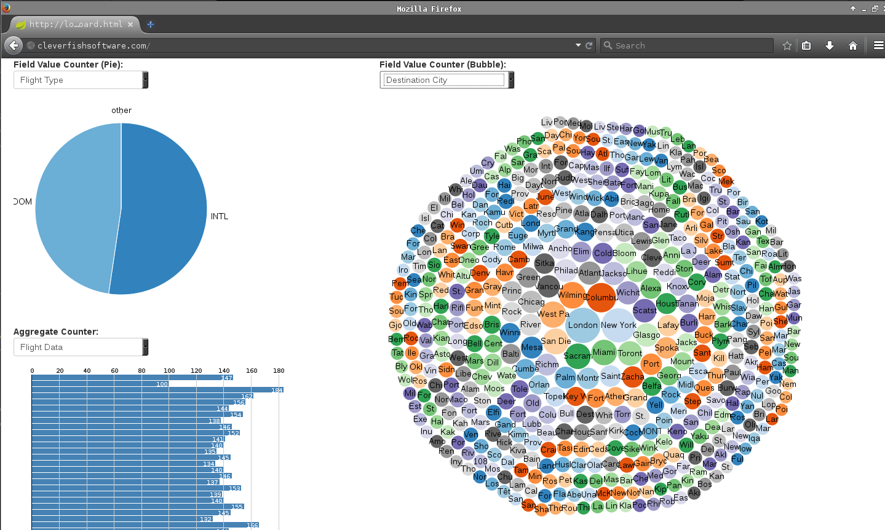

Enable Realtime Analytics with Spring XD!
=========================================

Okay now let's do a basic visualization of the data we are streaming. This won't be anything too complex, just aggregated totals based on the content of the data. We could use something more complex like Kafka+Storm+Redis+D3 which is a popular stack to do this type of work, but let's start with something that Spring XD gives us with very little work and complexity.

For this we need to create some "taps" off our main airshop_stream we created previously (see [STREAMING_API_SERVER.md](STREAMING_API_SERVER.md)). A "tap" is an apt term as we are not going to create new streams as much as we are going to modify the existing one(s) without disturbing any of the flow, all we do is take a "tap" off airshop_stream. Spring XD makes this quite easy and again we build a new stream. **And the best part is we do all this at runtime in real time**. We don't have to redefine or restart anything.

So, lets create a tap that takes the transformed (CSV to JSON) airshop_stream and creates a new counter that Spring XD will keep track of for the Flight Type. If you look at the JSON streaming in on of the consoles we used to create the Streaming API Server, you will see a field named fltType that is scoped by the flight object. So all we do is specify the field  and the type of Spring XD built-in counter 'field-value-counter' and deploy it. So get back to the Spring XD Shell terminal and enter the following "tap" stream definitions. 

``` console
stream create airshop_stream_flight_type_tap  --definition "tap:stream:airshop_stream.transform > field-value-counter --fieldName=flight.fltType --name='Flight Type'" --deploy
```

And a 'field-value-counter' for the flight arrival city (flight.airportCityArr)
``` console
stream create airshop_stream_flight_destination_city_count_tap --definition "tap:stream:airshop_stream.transform > field-value-counter --fieldName=flight.airportCityArr --name='Destination City'" --deploy
```

And a 'field-value-counter' for the flight departure city (flight.airportCityDpt)
``` console
stream create airshop_stream_flight_departure_city_count_tap --definition "tap:stream:airshop_stream.transform > field-value-counter --fieldName=flight.airportCityDpt --name='Departure City'" --deploy
```

Same thing for for the 'aggegate-counter' which will count all flights (each record over a period of time)
``` console
stream create airshop_stream_flight_count_tap --definition "tap:stream:airshop_stream.transform > aggregate-counter --name='Flight Data'" --deploy
```

Now we need to "see" the data. So we are going to launch a groovy web app using Spring Boot that will launch a web page configured to use the data visualization library 'd3' and use the built in Spring XD Admin REST API that exposes the collected analytics data (the datastructures we created when we defined and deploy our "taps" above).

For this, again open up a terminal and navigate to the demo.xd-analytics location and launch the spring boot web server.

``` console
[vagrant@estreaming ~]$ cd demo.xd-analytics-dashboard/
[vagrant@estreaming demo.xd-analytics-dashboard]$ spring run dashboard.groovy
```

And now open up a web browser to this location
[http://localhost:9889/dashboard.html](http://localhost:9889/dashboard.html)

And you should see something that looks like this:


Hit the dropdowns to get a feel for what the data "looks like".

here is how far it can go...

http://www.tnooz.com/article/a-fresh-way-of-visualizing-flight-search-aims-to-trump-ita-software-matrix-time-bars/
