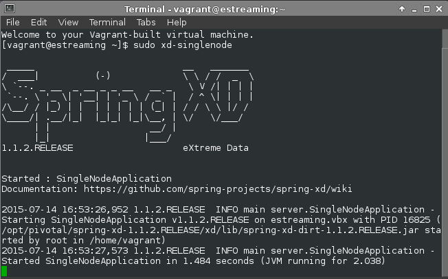
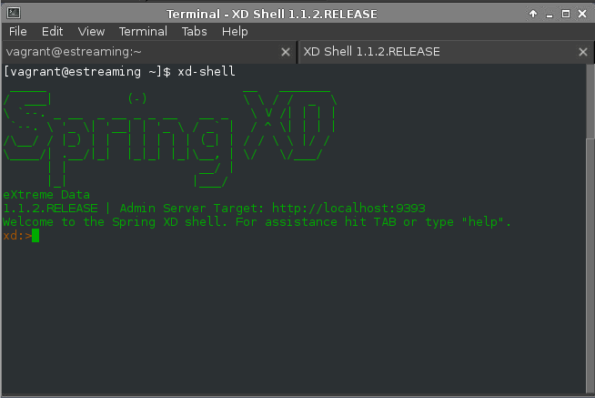
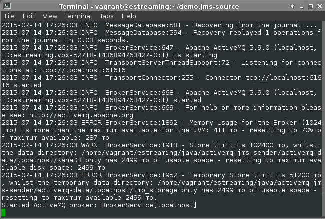
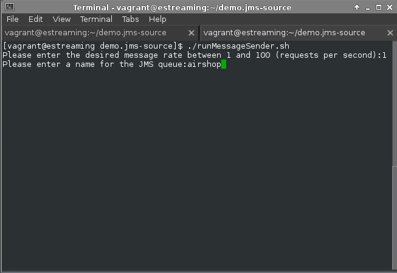

Welcome To estreaming!
======================

The goal of this project to build a server and a client capable producing and consuming a stream of data from virtually any data source.

The following instructions assume you have a running estreaming virtualbox running and you can connect to it using ssh or x2go client. It is easier to use x2go rather than using an ssh terminal client as we will be opening up quite a few terminals. Follow the instructions [here](https://github.com/petergdoyle/estreaming) or [file a git issue](https://github.com/petergdoyle/estreaming/issues) if you are having problems, and I will try to help you.

Spring XD provides us with a very straightforward, and powerful runtime system to define and manage data pipelines used for streaming data through. After a few examples you will see how it allows us to create streaming data pipeline definitions that are very much like creating UNIX pipelines. If you are not a UNIX user and are not familiar with the the pipeline concept, have a look [here](http://www.westwind.com/reference/os-x/commandline/pipes.html) first. A Spring XD "stream definition" will at a minimum consist of a data source and a data sink. Of course we can create more complex streams by adding other pipes and filters along the way.


**So let's get going**. If you have your virtualbox estreaming machine up and running and have connected to it using the X2Go client, open up a new terminal and type:

``` console
[vagrant@estreaming ~]$ sudo xd-singlenode
```

*This will start a single node instance of Spring XD and that is fine for this demo. For details on setting up Spring XD in more advanced configurations, check [here](http://docs.spring.io/spring-xd/docs/current/reference/html/#xd-distributed-runtime).*

You should see Spring XD start up



Give it a minute or so to get fully enabled and you should see something like:

```2015-07-14 16:53:47,743 1.1.2.RELEASE  INFO DeploymentSupervisor-0 server.ContainerListener - Scheduling deployments to new container(s) in 15000 ms```

Now open another tab on that terminal and type:

``` console
[vagrant@estreaming ~]$ xd-shell
```

You should see the Spring XD shell (client) start up




**So let's create our first data stream with Spring XD!** In order to do that we need to create a data source. Spring XD provides us with a variety of connectors to use as a source. For a full list refer to the documentation [here](http://docs.spring.io/spring-xd/docs/current/reference/html/#sources). For our demo we are going to create a JMS data source. In order to do that we need to create a JMS Message Broker and a JMS Message Producer.

Open up another terminal and change directory to the JMS demo directory.

``` console
[vagrant@estreaming ~]$ cd demo.jms-source
```

There are two java programs in there, which should have been built when the vm was provisioned. If for some reason you do not see a target directory, then run the command:

```
[vagrant@estreaming demo.jms-source]$ mvn clean install
```

There is a java program that will start up a single-node instance of ActiveMQ JMS Message Broker and listen on the default port. There is a little script in the directory to start up the broker. So let's start up the JMS Message Broker by typing:

```
[vagrant@estreaming demo.jms-source]$ ./runBroker.sh
```

Now you should see a single-node instance of ActiveMQ start up and initialize itself.



Now we need to start creating a steady stream of messages to be pushed into the messaging queue (managed by the Broker). There is another java program that will create pseudo-random airline search results for us. Since the data being generated represents shopping results for air travel, the queue name will be named 'airshop'. So let's start that up and start messages flowing by running the script to do that:


```
[vagrant@estreaming demo.jms-source]$ ./runMessageSender.sh
```

You will have to answer a couple of questions that the script needs to provide to the progam. For now, just respond with "1" and "airshop":



Hit return, and you should start seeing data rolling on the console that represents our holiday flight search results.

Now move back to the Spring XD Shell terminal and let's create our first data stream. Notice the data that is being pushed into the Message Queue is in CSV format. Many times the data sources that we have to work with come in a variety of formats that we have to deal with. For our purposes, we will want to convert that CSV format to JSON along the way since we are eventually going to push that data into MongoDb and out over a Streaming HTTP Connection using a REST API - so we need a Spring XD Transform to do that. And we also need a place to send the data to complete the stream definition. First let's create a simple stream definition and deploy it (run it) where we just push the CSV data directly into a file

```
xd:>stream create --name jmstest --definition "jms --destination=airshop  |file" --deploy
```

And now open up another terminal and we can see the data being redirected from the JMS source into a file on the file system.

``` console
[vagrant@estreaming ~]$ tail -f demo.xd-out/jmstest.out
```

And you should see data being produced and being tailed in two separate terminals. Okay now let's tranform it to JSON from CSV. First, let's undeploy the last Spring XD Stream so we don't fill up disk space. Go back to your Spring XD Shell terminal and type.

``` bash
xd:>stream undeploy jmstest
```

This will stop the stream but not destroy it. So let's create our new stream with an extra "|" (pipe) in there that will allow us to add a tranform. Spring XD allows us to create these little type of filters or transforms using either pure Java, or a special Expression Language ([SpEL](http://docs.spring.io/spring/docs/current/spring-framework-reference/html/expressions.html)), or in our case, a Groovy Script. Take a look at how easy it is to create a script to split the CSV payload into fields an reassemble them as JSON. This script has been installed in Spring XD so we can reference it in our stream definition, but you can view it.

``` console
[vagrant@estreaming ~]$ gedit demo.xd.scripts/airshop_csv_to_json_transform.groovy &
```

For more on creating and installing your own streaming data transforms check [here](http://docs.spring.io/spring-xd/docs/current/reference/html/#transform).

Now, lets create our new stream definition and deploy it. This one is similar to before except we are throwing the transform in between.

``` bash
stream create --name jmstest_with_transform --definition "jms --destination=airshop | transform --script=airshop_csv_to_json_transform.groovy | file" --deploy
```

Okay, go back to the same terminal that you did the "tail -f " on the other file and now type:

```console
[vagrant@estreaming ~]$ tail -f demo.xd-out/jmstest_with_transform.out
```

And you should see the the output now in JSON format. Okay now let's move on to the main data stream. In this one we are going to use the same JMS data source, the same Groovy transform script, but this time we are going to push the JSON encode payload into MongoDb. MongoDb is a JSON document database and we are using two very special features; the "capped collection" and a "tailable cursor". A "capped collection" is created to only allow a certain number of records to be captured in a collection (a data structure that might be considerd a 'table' in a rdbms). A "tailed cursor" is avaiable to clients connectin to mongo to establish a long running connection that will continue to flow data as records are added to the "capped collection". For more details check the Mongo documentation [here](http://docs.mongodb.org/manual/core/capped-collections/) and [here](http://docs.mongodb.org/manual/tutorial/create-tailable-cursor/). Remember, we are not building a "database" per se, only a buffer from where we will stream data from but we do want to be able to restart the stream if it should disconnect between server and client (both yet to be built yet but we will get there). For that reason a "capped collection" has already been created using the mongo console.

Open up another terminal (yes another) and start the mongo client by typing

```console
[vagrant@estreaming ~]$ echo "db.results.stats()" | mongo airshop
```

And you should see information about the collection  "results" from the database "airshop" indicating that the collection has indeed been set up as a capped collection with indicating a maximum record size of 5000 and a maximum disk size of 5242880 bytes (disk size overrules record size)

``` javascript
MongoDB shell version: 3.0.4
connecting to: airshop
{
	"ns" : "airshop.results",
	"count" : 5000,
	"size" : 2289016,
	"avgObjSize" : 457,
	"numExtents" : 1,
	"storageSize" : 5242880,
	"lastExtentSize" : 5242880,
	"paddingFactor" : 1,
	"paddingFactorNote" : "paddingFactor is unused and unmaintained in 3.0. It remains hard coded to 1.0 for compatibility only.",
	"userFlags" : 1,
	"capped" : true,
	"max" : 5000,
	"maxSize" : 5242880,
	"nindexes" : 1,
	"totalIndexSize" : 179872,
	"indexSizes" : {
		"_id_" : 179872
	},
	"ok" : 1
}
bye

```

So now back to he the Spring XD Shell terminal and we will create the new stream that will take the JMS CSV flight search data and tranform it into JSON and move it into our capped Mongo db collection.

``` bash
stream create --name airshop_stream --definition "jms --destination=airshop | transform --script=airshop_csv_to_json_transform.groovy | mongodb --databaseName=airshop --collectionName=results"
```

Okay now open up another terminal and let's run a program that connects directly to the mongo capped collection that is now filling up with flight search data. For this we are going create a node.js program that connects to the database and creates a "tailable curser".

``` console
[vagrant@estreaming ~]$ cd demo.node/mongo_connect/
[vagrant@estreaming mongo_connect]$ more streaming_client_mongojs.js
```
And the program should display
``` javascript
var mongojs = require('mongojs');
var JSONStream = require('JSONStream');

var url = 'mongodb://localhost:27017/airshop';

var db = mongojs(url, ['results']);

//create a cursor and use the console command
var cursor = db.results.find({}, {}, {tailable:true, timeout:false});

// since all cursors are streams we can just listen for data
cursor.on('data', function(doc) {
    console.log(doc);
});

```
So let's run the node.js program. If for whatever reason you don't find a node_modules folder in the directory you will have to run a ```npm install``` command first and then the ```node streaming_client_mongojs.js``` command.

``` console
[vagrant@estreaming mongo_connect]$ node streaming_client_mongojs.js
```

And you should see the program catch up to the end of stream in the mongo collection and then start keeping time with the original jms-sender program. This program works fine but we want to be able to connet the streaming data using HTTP and be able to interact with it using a REST API. That is where the node.js server comes in. We will use express.js to build our routes and web server on top of the node.js runtime.

Open up another console and go into the folder where the node server is located

``` console
[vagrant@estreaming ~]$ cd demo.node/streaming_api_server/
[vagrant@estreaming ~]$ more routes/airshop.js
```

And you can see the server routing program that will allow us to interact with the data stream using a RESTful route mapping.

``` javascript
var express = require('express');
var router = express.Router();
var JSONStream = require('JSONStream');
var http = require('http'), queryString = require('querystring');


//mongojs stuff...
var mongojs = require('mongojs');
var url = 'mongodb://localhost:27017/airshop';
var db = mongojs(url, ['results']);
db.on('error',function(err) {
    console.log('database error', err);
});
db.on('ready',function() {
    console.log('database connected');
});

/* GET results starting at id specified ... */
router.get('/results/frame/:frame', function(req, res, next) {
    var frame = req.params.frame;
    var fieldFilter = {};
    var frameFilter = {};
    frameFilter['_id'] = { $gte: mongojs.ObjectId(frame)};
    res.setHeader('content-type', 'application/json');
    res.connection.setTimeout(0);
    db.results
        .find(frameFilter,
            fieldFilter,
            {tailable:true, timeout:false})
	    .pipe(JSONStream.stringify())
	    .pipe(res);
});


/* GET results starting at id specified ...*/
router.get('/results/', function(req, res, next) {

    var frame = req.query.frame;
    var fields = req.query.fields
    console.log('url =',req.url)
    console.log('frame=',frame);
    console.log('fields=',fields);

    var fieldFilter = {}; //
    if (fields) {
        fields.split(',').forEach(function(f) {
            fieldFilter['flight.'.concat(f)] = 1;
        });
    }

    var frameFilter = {};
    if (frame) {
        frameFilter['_id'] = { $gte: mongojs.ObjectId(frame)};
    }

    res.setHeader('content-type', 'application/json');
    res.connection.setTimeout(0);
    db.results
        .find(frameFilter, fieldFilter,
        {tailable:true, timeout:false})
	    .pipe(JSONStream.stringify())
	    .pipe(res);

});

```

Okay now let's start the server. Again, if for some reason you don't find a node_modules folder you will have to run a ```npm install``` command first and then a ```npm start``` command

``` console
[vagrant@estreaming streaming_api_server]$ npm start

> streaming_api_server@0.0.0 start /home/vagrant/estreaming/node/streaming_api_server
> node ./bin/www

````
Okay we are done with the Streaming API Server. Now let's connect with a simple curl command and see if we can nnow stream the data over HTTP. The server is running on port 3000 on localhost. Find a free terminal and type the command to stream all the data in the mongo capped collection back through the console.

``` console
[vagrant@estreaming ~]$ curl http://localhost:3000/airshop/results
```
Now let's try something different. Let's start the stream at a different location other than the end. There is a little node.js program that will help us find a record identifier 1000 records from the end of what is currently in the mongo db collection. If you noticed when we ran the mongo client program the record identifiers are added by mongo as they are added to the cappdc colelction
